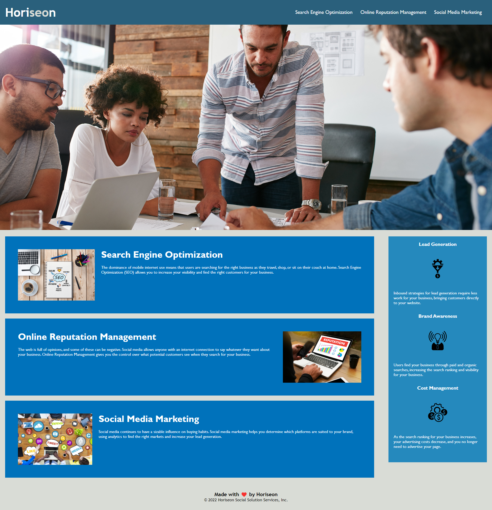

# Rutgers Bootcamp Challenge 1 - HTML CSS Git: Code Refactor

## Description
This website was created so students can show how to use HTML, CSS and Git as a lesson in Refactoring.  The html and css files needed to be refactored because the original versions were written using semantic HTML.  If the original website had been real, handicapped people would have had a hard time using it.  

The new website, like the one I created by refactoring the existing html and css files, will now be accessible to all users.  Plus, the semantic language used in my version will also make my html page is better set to be found since semantic html also helps sites be optimized for search engines.  

Finally, by refactoring the HTML code and cleaning up the CSS file to remove redundancy, and organize the file better, if this were a real project, future designers or web developers looking at my code would appreciate the logic and comments in my code.  

This process makes it easier for teams to work on each other's code, which is always important, especially for large projects.  I always comment my code well and think how I would want others to do comments before me and I want to leave my code that way for them.  

Although I worked with HTML a long time ago, CSS was not really out at that time.  I did eventually learn some CSS later on but it was still a long time ago, way before HTML5.  I am not suprised at how different the tools and languages have changed.  I need to keep working harder to keep up with the complicatoin level and difficultties with how all the new parts work with one another.  

This project also gave us another chance to use Git/Github and VS Code, with which I still need much practice.

Note:  Because this was a class assignment, I included many comments to help me use this project as a study guide in the future and also to show that I understood why I made the changes I did.  In real life programming though, I would only comment code and changes that are not self-explanatory to other programmers who may need to work on the same code in the future.

User Story:
AS A marketing agency
I WANT a codebase that follows accessibility standards
SO THAT our own site is optimized for search engines

Acceptance Criteria:
GIVEN a webpage meets accessibility standards
WHEN I view the source code
THEN I find semantic HTML elements
WHEN I view the structure of the HTML elements
THEN I find that the elements follow a logical structure independent of styling and positioning
WHEN I view the image elements
THEN I find accessible alt attributes
WHEN I view the heading attributes
THEN they fall in sequential order
WHEN I view the title element
THEN I find a concise, descriptive title

## Table of Contents

Note: Only lowercase letters after the # signs below or links don't work.
- [Description](#description)
- [Installation](#installation)
- [Usage](#usage)
- [Credits](#credits)
- [License](#license)
- [Badges](#badges)
- [Features](#features)
- [How-to-Contribute](#how-to-contribute)
- [Tests](tests)

## Installation

We used the VS Code software to edit code, git to pull the starter code to our local machines and then git again to push our final versions to GitHub.  

## Usage

Here's a link to my website stored in GitHub:
https://abrownstein2022.github.io/Mod1CSSChallenge/

Here's a screenshot of my final webpage from a browser:
    

    

## Credits

Some students in the class got together on Zoom to review any issues we were having with the challenge and try to help each other resolve and understand the issues.  I think we had different ways of approaching this project but it was helpful to get some feedback on our different approaches.  

## License

As this is a homework exercise, no license is needed.

## Badges

N/A

## Features

The main features in this project are semantic language and cleaner, commented code in both the HTML and CSS files.

## How-to-Contribute

N/A

## Tests

I tested my changes heavily.  

First, I set up a test envrionment by renaming the html and css files, and changing the css file name in my test file.  In this way, I was able to easily test my version against the started file html file while I was working.  I just had to refresh my browser to see how the changes I made in the code affected the display.  

By having a set of original and test code, I could also easily compare my updated file with the original file in VS code.  I found this particularly helpful as I messed up the page and had to fix it several times.

Once my changed versions worked okay, I moved the orignal files out of my local folder and renamed the working files to the original names.  I have done this many times in my job over the years and it has worked well for me.

Then I pushed my code to github using Git.  I copied the URL from the code button in Github and tested that URL in a different browser than I was testing in to ensure the website was indeed working properly.